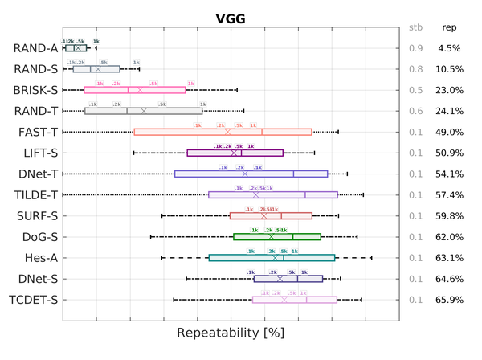
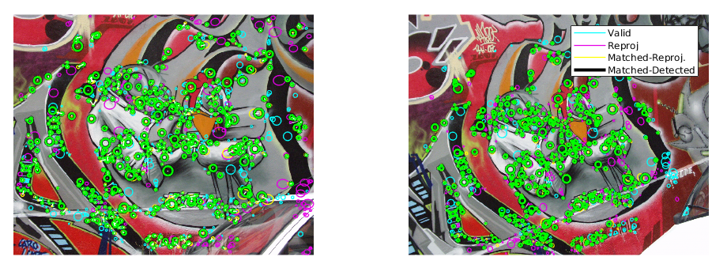

# VLB-Deteval

Source code for *Large scale evaluation of local image feature detectors on homography datasets* (BMVC 2018) [[ArXiv]](https://arxiv.org/abs/1807.07939).

This project is based on the VLB library and is written in MATLAB. Binary version can be run with the free [MATLAB SDK](./MCR.md).

For a tutorial how to evaluate a new detector, please see the following [instructions](./detect/README.md).

## Installation
If you have MATLAB 2017a (older versions not tested), you can use source code directly.
Otherwise you can use the binary distribution with the [MATLAB Compiler Runtime (MCR)](./MCR.md).

### Setup
To set up the MATLAB environment and to compile the VLB mex files, simply run:
```matlab
>> de
```
This also shows the list of available commands.

### Provision data files
To download the compact archive with the final results of each detector (800kiB), run:
```matlab
>> de provision scores-compact
```

To download all the results data (2.3GiB), e.g. to view the per-image result), run:
```matlab
>> de provision scores-all
```

Additionally, you can download all the detected keypoints (573MiB), needed when specifying a new experiment:
```matlab
>> de provision features
```

## Reproduce published results
To generate the published figures, you can simply run:
```matlab
>> de provision scores-compact
>> de results expdef/bmvc_results.json
```

This will create the results figures and a rank table in `./data/results/bmvc_results/`.
The figures are exported in png and tikz format. Rank table is in LaTex format. The figures should look like the following example:



You can also recompute all results when only features are privisioned:
```matlab
>> !rm -rf ./data/scores/bmvc_results_*
>> de provision features
>> de results expdef/bmvc_results.json
```
it might take few hours.

## Visualising image matches
To visualise the image matches, provision the full scores files (`de provision scores-all`).
Additionally, a dataset images will be downloaded if not present.

### Visualise an image pair
To visualise and image pair of a dataset (task), run:
```matlab
>> de view matchpair <datasetname> <taskid>
```

For example, calling `view matchpair vggh 1` results in:


### Visualise detected keypoints
To visualise detections, run:
```matlab
>> de view detections <datasetname> <featsname> <imid>
```
this assumes that the features of `featsname` are provisioned in `./data/features/featsname`.

For example, calling `view detections vggh m-surf-ms 1` results in:


### Visualise matching results
To visualise matching results, run:
```matlab
>> de view matches <benchmarkname> <datasetname> <featsname> <taskid>
```
this assumes that all scores are either provisioned or computed. The benchmark name
is for example `bmvc_results_N` which is the repeatability for the top-N features.

For example, calling `view matches bmvc_results_1000 vggh m-surf-ms 1` results in:



## Authors

* **Karel Lenc** - *Initial work* - [lenck](https://github.com/lenck)

## Citation

Please cite us if you use this code:

```
@article{VlbDet18,
 author = {Karel Lenc and Andrea Vedaldi},
    title = "{Large scale evaluation of local image feature detectors on homography datasets}",
    journal = {BMVC},
    year = 2018,
    month = sept
}
```
